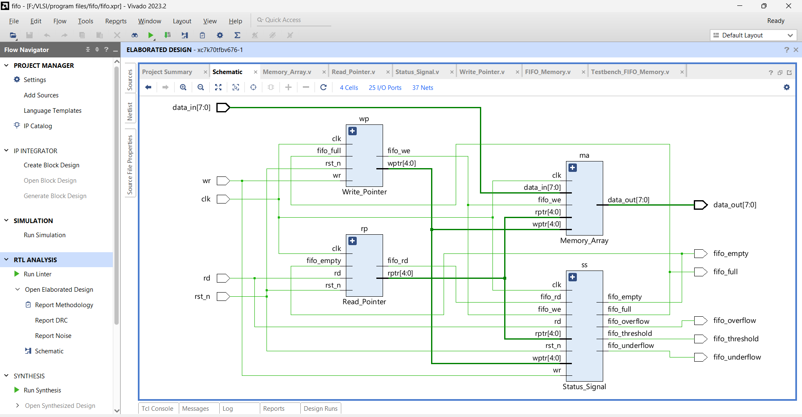
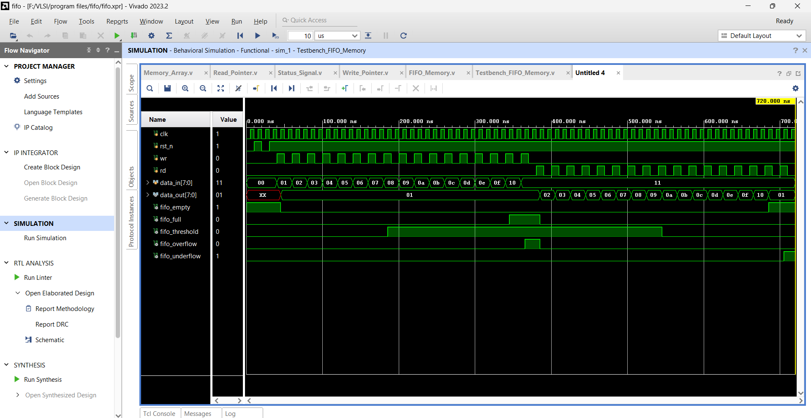

# FIFO Memory in Verilog

## Overview

This project implements a 16-stage, 8-bit wide First-In-First-Out (FIFO) memory using Verilog. FIFO memory is a type of data buffer or queue where the first data written is the first data read, similar to a queue in software programming. It is commonly used in digital systems to manage data flow between processes that operate at different rates or with varying latency requirements.

### Features

- **16-Stage Buffer:** The FIFO has 16 stages, each capable of holding an 8-bit data word.
- **Status Signals:**
  - **Full:** Indicates when the FIFO is full and no more data can be written.
  - **Empty:** Indicates when the FIFO is empty and no more data can be read.
  - **Overflow:** Indicates when an attempt is made to write data to a full FIFO.
  - **Underflow:** Indicates when an attempt is made to read data from an empty FIFO.
  - **Threshold:** A customizable signal to indicate when the number of data words is below a specific threshold.

### Learning Objectives

- **Digital Design:** Learn how FIFO buffers work and their applications in digital systems.
- **Verilog Proficiency:** Gain experience in using Verilog HDL for modeling and simulating hardware behavior.
- **FPGA Development:** Understand the process of designing, simulating, and implementing digital circuits on FPGAs.
- **Verification and Testing:** Develop skills in writing testbenches and verifying digital circuit designs through simulation.

## Schematic



## Simulation



## Project Structure

```plaintext
fifo-memory/
├── sources_1/
│   ├── fifo_mem.v             # Top-level FIFO module
│   ├── memory_array.v         # Memory array submodule
│   ├── write_pointer.v        # Write pointer submodule
│   ├── read_pointer.v         # Read pointer submodule
│   └── status_signal.v        # Status signals submodule
├── sim_1/
│   └── tb_fifo.v              # Testbench for the FIFO memory
├── images/
│   ├── fifo_schematic.png     # Schematic of the FIFO design
│   └── fifo_simulation.png    # Simulation results
└── README.md

## Usage

### Prerequisites

- **Verilog Simulator:** You will need a Verilog simulation tool like ModelSim or Xilinx Vivado to run the simulations.
- **FPGA Development Board:** If you wish to implement the design on hardware, an FPGA development board is required.

### Running the Simulation

1. **Clone the Repository:**

    ```bash
    git clone https://github.com/yourusername/fifo-memory.git
    cd fifo-memory
    ```

2. **Open the Project in Your Verilog Simulator:**

   - Open the source files located in the `src` directory.
   - Open the testbench file located in the `tb` directory.

3. **Run the Simulation:**

   - Compile the Verilog code and run the testbench.
   - Observe the output waveforms and verify the functionality of the FIFO memory.

4. **Review Results:**

   - Check the simulation output to ensure all status signals (Full, Empty, Overflow, Underflow, Threshold) operate correctly.
   - Compare the simulation results with expected behavior.

### Conclusion

This project has been undertaken for educational purpose only. Through this project, I learned how to write modular and reusable Verilog code by creating separate modules for different components of a FIFO memory system, such as the write pointer, read pointer, memory array, and status signal logic. I also gained a deeper understanding of how FIFO memory operates, including the roles of read and write pointers, and how to manage status signals like full, empty, overflow, and underflow. This project enhanced my ability to synchronize data flow and ensure efficient and reliable data storage and retrieval, as well as verify hardware designs through simulation using tools like Xilinx Vivado.
